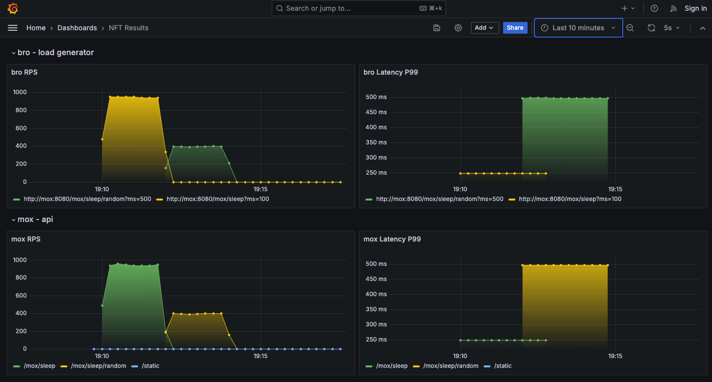

# NFT Examples



Using [bro](https://github.com/lameaux/bro) and [mox](https://github.com/lameaux/mox) for non-functional testing:

Make sure you have `make`, `docker` and `docker-compose` installed in your system.

```shell
make SHOW_RESULTS=true test

4:09PM INF bro build=82b277b version=v0.0.1
4:09PM INF config loaded config={"name":"Mox Sleep","path":"./scenarios/mox/sleep.yaml"}
4:09PM INF executing scenarios... press Ctrl+C (SIGINT) or send SIGTERM to terminate. parallel=false
4:09PM INF running scenario scenario={"duration":120000,"name":"Sleep 100 ms","queueSize":100,"rps":1000,"threads":100}
4:11PM INF running scenario scenario={"duration":120000,"name":"Random sleep 500 ms","queueSize":100,"rps":500,"threads":100}
4:13PM INF result success=true totalDuration=243691
Name: Mox Sleep
Path: ./scenarios/mox/sleep.yaml
┌─────────────────────┬────────┬─────────┬────────┬─────────┬─────────┬──────────────┬──────────┬─────┬────────┐
│ SCENARIO            │  TOTAL │ SUCCESS │ FAILED │ TIMEOUT │ INVALID │ LATENCY @P99 │ DURATION │ RPS │ PASSED │
├─────────────────────┼────────┼─────────┼────────┼─────────┼─────────┼──────────────┼──────────┼─────┼────────┤
│ Sleep 100 ms        │ 113980 │  113980 │      0 │       0 │       0 │ 114 ms       │ 2m1.479s │ 938 │ true   │
│ Random sleep 500 ms │  48000 │   48000 │      0 │       0 │       0 │ 496 ms       │ 2m2.212s │ 393 │ true   │
└─────────────────────┴────────┴─────────┴────────┴─────────┴─────────┴──────────────┴──────────┴─────┴────────┘
Total duration: 4m3.691s
OK

Test results in Grafana: http://0.0.0.0:3000
Press any key to continue...
```
